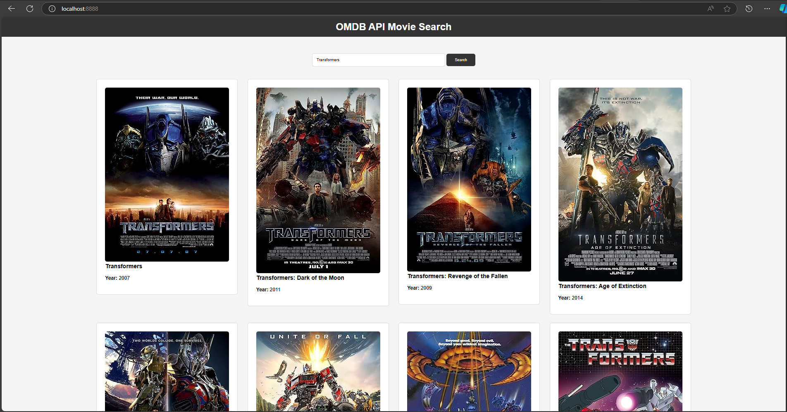

## OMDB API Movie Search
    

### Deskripsi
    Proyek ini adalah aplikasi pencarian film menggunakan OMDB API. 
    Aplikasi ini terdiri dari backend yang dibangun dengan Spring Boot dan 
    frontend menggunakan HTML dan JavaScript. Pengguna dapat mencari film berdasarkan judul, 
    dan hasilnya akan ditampilkan dalam bentuk kartu dengan gambar poster dan detail film.

### Fitur
    - Pencarian film berdasarkan judul.
    - Menampilkan hasil pencarian dalam bentuk kartu dengan gambar poster dan detail film.
    - Backend menggunakan Spring Boot untuk mengakses OMDB API.
    - Frontend menggunakan HTML dan JavaScript.

### Konfigurasi
    spring:
    application:
        name: backand

    omdbapi:
        url: https://www.omdbapi.com/
        apiKey: c25b75b7  # Gantilah dengan API Key dari OMDB

    server:
        port: 8889

### Endpoint
    - GET: /api/movie

        Example: http://localhost:8888/api/movie?title=transformer
